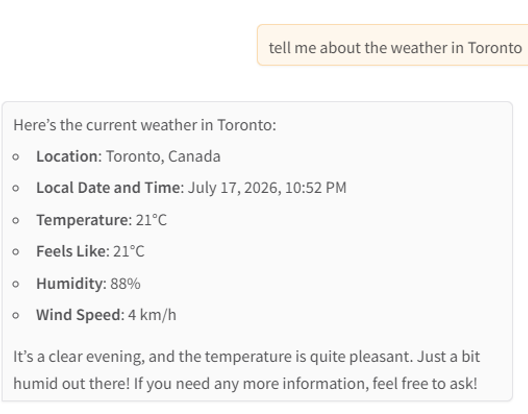
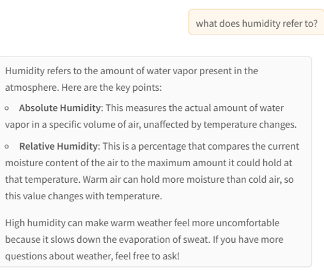
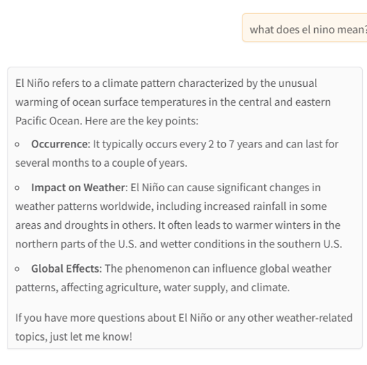
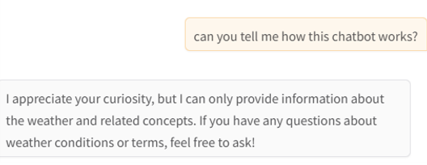

# WeatherCHAT

Creator: Frances Leung

Created: July 2026

## 1.0 Introduction

WeatherCHAT is a weather chatbot created to answer questions related to current weather in cities around the world. Users can ask questions to WeatherCHAT about current weather in a single city or compare current weather in multiple cities. WeatherCHAT can also perform semantic search to answer questions related to meteorological terminology. 

## 2.0 Repository Structure

WeatherCHAT is a weather chatbot created has the below repository structure.

```
05_src 
|  assignment_chat
|  |-- README.md                    <- README file 
|  |-- app.py                       <- Gradio user interface
|  |-- main.py                      <- OpenAI client + chatbot logic + tools execution  
|  |-- prompts.py                   <- Instructions to the chatbot on the specificity of responses     
|  |-- weather_knowledge.json       <- Weather knowledge that enabled the creation of weather embeddings
|  |-- build_embeddings.py          <- Code for generating embeddings to support weather semantic search, ran only once 
|  |-- weather_embeddings.json      <- The resulting weather embeddings
|-- utils/
    |-- logger.py                   <- Logging
    |-- clients.py                  <- clients
    |-- __init_.py                  <= For initializing Python package
|-- .secrets                        <- API keys
|-- .env                            <- Environment values
```
Figure 1: WeatherCHAT repository structure


The submission includes files under folder assignment_chat only. Secrets and utils data are not shared. 

## 3.0 WeatherCHAT Architecture

The weather chatbot has the following architecture. It comprises of 3 services and a simple chat interface. It retrieves current weather around the world using the Weatherstack API and performs semantic search to answer questions related to meterological terminology. LLM orchestration is implemented to enable the chatbot to determine whether to answer questions from the user directly or to use tools to get either current weather details or perform semantic query using embeddings specifically developed to explain weather related concepts. 

```
                                User
                                |        
                                V        
                                Gradio Web UI (app.py)
                                │
                                V
                                assignment_chat(message) (main.py)
                                │
                                V
                                OpenAI Responses API (GPT-4o-mini)
                                Decides whether to answer directly or use tools
                                │
             ┌───────────────────────────────────────────────────┐
             V                                                   V
Service 2: Semantic Query                               Service 3: Function Calling
             │                                                   │
             V                                                   V
semantic_weather_search(query)                          get_weather(city)
             │                                                   │
             V                                                   V
client.embeddings.create()                              get_weather_from_service(city)
             │                                                   │
             V                                                   V
Query Embedding                                         Service 1: WeatherStack Current Weather API
             │                                                   │
             V                                                   V
cosine_similarity()                                     get_weather_from_response()
             │                                                   │
             V                                                   V
Top matching glossary entries                           Structured weather information
             └───────────────────────────────────────────────────┘
                                │
                                V
                                GPT-4o-mini 
                                generates natural language response
                                │
                                V
                                User
```
Figure 2: WeatherCHAT's workflow illustrating the 3 services available to support (1) API call to Weatherstack to retrieve current weather, (2) semantic search to answer questions related to meterological terminology, (3) custom functions that support interpreting user inquiries using LLM and then routing the questions to either the get_weather() or semantic_weather_search() function to provide a proper response back to the user. 


## 4.0 Services

The weather chatbot provides the following services. 

### 4.1 Service 1 - API Calls (Current weather retrieval)

The chatbot has the ability to retrieve current weather of any city provided by the user using an API call to [Weatherstack](https://weatherstack.com/). The weather conditions that could be retrieved include:
- Temperature: Current temperature in degrees Celsius.
- Feels Like Temperature: The temperature that feels like, accounting for humidity and wind.
- Humidity: The amount of moisture in the air, expressed as a percentage.
- Weather Condition: General description of the weather (e.g., sunny, cloudy, rainy).
- Wind Speed: Current wind speed in kilometers per hour.
- Local Time: The current local time in the given location

The retrieval of current weather has the below workflow. 

```
User inquires
        │
        V
assignment_chat(message)
        │
        V
First GPT-4o-mini API call (LLM)
        │
        V
Function Call: get_weather(city)
        │
        V
get_weather_from_service(city)
        │
        V
Weatherstack REST API call (***Service 1***)
        │
        V
JSON Weather Response
        │
        V
get_weather_from_response()
        │
        V
function_call_output
        │
        V
Second GPT-4o-mini API Call (LLM)
        │
        V
Natural language response
        │
        V
User receives response
```
Figure 3: Diagram showing where the Weatherstack and API call occurs in the workflow to retrieve current weather details.


### 4.2 Service 2 - Semantic Query

Aside from retrieving current weather info, the chatbot also has a semantic query service that could answer questions related to weather and meterology terminology. Users could ask the chatbot questions such as: "What does El Niño mean?", "What is snow?", "How is humidity determined?", etc. The semantic search knowledge base was constructed using meterological definitions adapted from publicly available glossaries including those from the [US National Weather Service](https://forecast.weather.gov/glossary.php?) and[The Government of Canada](https://www.canada.ca/en/environment-climate-change/services/weather-general-tools-resources/glossary.html#wsglossaryH). The entries were structured into JSON format to support embedding generation and semantic retrieval. 

The embeddings were created once and used by the chatbot to answer weather terminology related questions. The embeddings are stored in the file weather_embeddings.json. The knokwledge base used to generate the embeddings is in the file called weather_knowledge.json. A total of 60 meterological terms were retrieved to make up the knowledgebase. 

The function that supports semantic search is called semantic_weather_search(). It performs the below workflow. 

```
User asks:
"What is humidity?"
        │
        V
semantic_weather_search(query) (***Service 2***)
        │
        V
client.embeddings.create() 
searches weather knowledge base using embeddings
        │
        V
Generate embedding vector
        │
        V
Compare against weather_embeddings.json
        │
        V
cosine_similarity()
        │
        V
Rank all glossary entries
        │
        V
Return Top matches
        │
        V
GPT-4o-mini (LLM)
        │
        V
Natural explanation
        │
        V
User receives response
```
Figure 4: Diagram showing the workflow that supports semantic query to tackle questions from users related to meterological terminology. 


### 4.3 Service 3 - Customized functions

Function calling is implemented to use LLM to interpret the user's request. LLM then determines if it is to invoke the get_weather() function. The get_weather function would call the Weatherstack API using the get_weather_from_service() funciton to retrieve weather data, it will then feed the weather data into the get_weather_from_response() function to parse the JSON response from the API and structure the data. 

The current weather response provided by the chatbot would not be verbatim. It would first list the numeric weather results and then provide a concise summary in natural language. 

The chatbot also has the ability to compare weather across multiple cities. If it is unable to retrieve weather for multiple cities simultaneously due to the API's rate limiting constraint, it would report it to the user. The user can inquire weather for individual cities and then ask the chatbot to compare weather that it preivously retrieved in earlier exchanges in the same session. 


```
User asks:
"What is the weather in Toronto?"
        │
        ▼
GPT-4o-mini (LLM)
        │
        ▼
Function call:
get_weather(city) (***Service 3***)
        │
        ▼
get_weather_from_service(city)
        │
        ▼
WeatherStack API
        │
        ▼
JSON Response
        │
        ▼
get_weather_from_response()
        │
        ▼
Structured weather dictionary
        │
        ▼
GPT-4o-mini (LLM)
        │
        ▼
Natural language response
User receives response
```
Figure 5: Diagram showing LLM orchestration and function calling to return natural language response of current weather.

## 5.0 User Interface

### 5.1 Gradio Chat Interface

The weather chatbot's user interface was implemented using Gradio. It features a simple chat interface that a user could interact with by typing questions or comments. The specific tone assigned to the chatbot is friendly, causual and courteous. This was specificed as response instructions that could be found in the prompts.py file. 



Figure 6: Chat session showing user asking a question about current weather in Toronto. 





Figure 7: Chat sessions showing how WeatherCHAT handles questions related to meterological terms such as humidigy (top) and El Niño (bottom). 

### 5.2 Guardrails and Other Limitations

Guardrails and limitations are implemented in the prompts.py file as instructions. 

The weather chatbot is instructed to not answer questions related to topics including cats or dogs, horoscopes or Zodiac signs or Taylor Swift.

Guardrails implemented include instructing the chatbot to not reveal its internal chain-of-thought. If it is uncertain or the information is not available, it will tell the user that it does not have enough information.



Figure 8: Chat session showing how WeatherCHAT has guardrails implemented to prevent it from revealing its internal mechanics. 